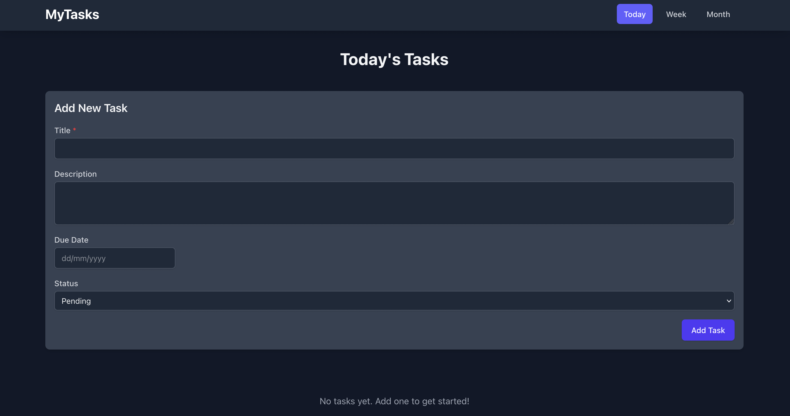
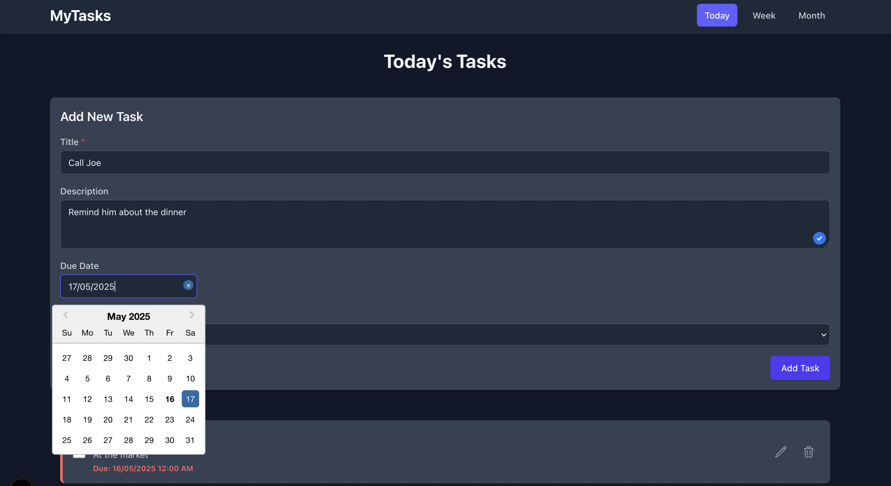
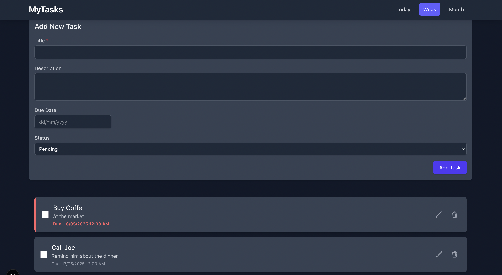

# Gerenciador de Tarefas

## Descrição do Projeto

Este é um aplicativo de gerenciador de tarefas, desenvolvido para ajudar os usuários a organizar suas atividades diárias, semanais e mensais. A aplicação permite criar, visualizar, editar, marcar como concluída e excluir tarefas, além de oferecer uma interface limpa e intuitiva com suporte a tema claro e escuro.

O desenvolvimento deste projeto foi significativamente auxiliado pela ferramenta **Task Master** para o planejamento e organização das tarefas do MVP, garantindo um fluxo de trabalho estruturado e eficiente.

## Funcionalidades Principais

*   **Criação de Tarefas:** Adicione novas tarefas com título, descrição e data de vencimento.
*   **Visualização de Tarefas:**
    *   Tarefas do Dia
    *   Tarefas da Semana
    *   Tarefas do Mês
*   **Edição de Tarefas:** Modifique os detalhes de tarefas existentes.
*   **Marcar como Concluída/Pendente:** Alterne o status das tarefas.
*   **Exclusão de Tarefas:** Remova tarefas que não são mais necessárias.
*   **Persistência Local:** As tarefas são salvas no `localStorage` do navegador.
*   **Tema Claro e Escuro:** Alterne entre os temas para melhor conforto visual.
*   **Design Responsivo:** Interface adaptável a diferentes tamanhos de tela.

## Tecnologias Utilizadas

*   **Next.js (v14+):** Framework React para renderização no servidor (SSR), geração de sites estáticos (SSG) e uma excelente experiência de desenvolvimento.
*   **React (v18+):** Biblioteca JavaScript para construção de interfaces de usuário.
*   **TypeScript:** Superset do JavaScript que adiciona tipagem estática, melhorando a manutenibilidade e a detecção de erros.
*   **Tailwind CSS:** Framework CSS utility-first para estilização rápida e customizável.
*   **Heroicons:** Biblioteca de ícones SVG de alta qualidade.
*   **React Context API:** Para gerenciamento de estado global (tarefas e tema).
*   **Date-fns:** Biblioteca para manipulação de datas.

## Como Rodar o Projeto Localmente

Siga as instruções abaixo para executar o projeto em seu ambiente de desenvolvimento:

1.  **Clone o Repositório:**
    ```bash
    git clone https://github.com/renanbmello/my-tasks
    cd my-tasks
    ```

2.  **Instale as Dependências:**
    Use o gerenciador de pacotes de sua preferência (`npm` ou `yarn`):
    ```bash
    npm install
    # ou
    yarn install
    ```

3.  **Execute o Servidor de Desenvolvimento:**
    ```bash
    npm run dev
    # ou
    yarn dev
    ```

4.  **Acesse no Navegador:**
    Abra seu navegador e acesse `http://localhost:3000`.

## Demonstração Visual

Aqui você pode ver algumas telas da aplicação em funcionamento:

**Visualização Principal (Tarefas do Dia):**


**Adicionando uma Nova Tarefa:**


**Visualização Semanal:**



## Decisões Técnicas e Arquitetura

A arquitetura do projeto foi pensada para ser modular, escalável e de fácil manutenção, seguindo as melhores práticas de desenvolvimento com Next.js e React.

*   **Estrutura de Pastas:**
    *   `src/app/`: Contém as rotas principais da aplicação (Today, Week, Month) utilizando o App Router do Next.js.
    *   `src/components/`: Componentes React reutilizáveis como `TaskList`, `TaskItem`, `TaskForm`, `AppHeader`, `ThemeToggle`.
    *   `src/contexts/`: Contextos React para gerenciamento de estado global (`TaskContext` para tarefas, `ThemeContext` para o tema).
    *   `src/lib/`: Funções utilitárias, como as de manipulação de datas (`dateUtils.ts`) e serviços (`storageService.ts`).
    *   `src/types/`: Definições de tipos TypeScript para garantir a consistência dos dados.

*   **Componentização:**
    A aplicação foi construída com uma forte ênfase na componentização. Cada parte da UI com responsabilidade específica foi encapsulada em seu próprio componente. Isso promove a reutilização de código e facilita os testes e a manutenção. Por exemplo, o `TaskList` é responsável por exibir a lista de tarefas e pode ser usado em diferentes páginas (Hoje, Semana, Mês) apenas passando as tarefas filtradas adequadamente.

*   **Gerenciamento de Estado:**
    *   **TaskContext:** Centraliza toda a lógica relacionada às tarefas (buscar, adicionar, editar, excluir, alternar status). Isso evita a prop drilling e torna o estado das tarefas acessível de qualquer componente que precise dele.
    *   **ThemeContext:** Gerencia o estado do tema (claro/escuro) e persiste a preferência do usuário no `localStorage`.
    *   O hook `useMemo` foi utilizado em pontos estratégicos (como na filtragem e ordenação de tarefas nas páginas de visualização) para otimizar o desempenho, recalculando valores derivados apenas quando suas dependências mudam.

*   **Estilização com Tailwind CSS:**
    Optamos pelo Tailwind CSS por sua abordagem utility-first, que permite construir interfaces customizadas rapidamente sem escrever CSS tradicional. Ele facilita a criação de um design responsivo e a implementação de temas (como o modo escuro, através de classes `dark:`).

*   **Persistência de Dados:**
    As tarefas e a preferência de tema são salvas no `localStorage` do navegador, permitindo que os dados do usuário persistam entre as sessões. O `storageService.ts` abstrai essa lógica.

*   **Boas Práticas Adotadas:**
    *   **Código Limpo e Modular:** Funções e componentes com responsabilidades únicas.
    *   **Tipagem com TypeScript:** Para maior segurança e clareza no desenvolvimento.
    *   **Tratamento de Estados:** Feedback visual para estados de carregamento (`isLoading`) e erros.
    *   **Consistência de UI/UX:** Padronização das visualizações de "Hoje", "Semana" e "Mês", e remoção de redundâncias (como múltiplos botões para adicionar tarefas) para uma experiência de usuário mais fluida.

## Uso de Inteligência Artificial

O desenvolvimento deste projeto contou com o auxílio de ferramentas de Inteligência Artificial (IA), como o Cursor (com o modelo Gemini do Google) e o Task Master.

*   **Task Master:** Desde o início, o Task Master foi fundamental para definir o escopo do MVP (Minimum Viable Product) e organizar todas as etapas de desenvolvimento em tarefas menores e gerenciáveis. Isso permitiu um acompanhamento claro do progresso e a priorização eficiente das funcionalidades.

*   **Cursor (Gemini):** A IA generativa foi utilizada para:
    *   **Refatoração:** Sugestões e implementações de melhorias no código existente.
    *   **Resolução de Problemas:** Auxílio na depuração e na busca por soluções para desafios específicos.
    *   **Criação de Documentação:** Assistência na elaboração deste `README.md` e de outros documentos.

O uso da IA acelerou significativamente o desenvolvimento, permitindo focar mais nas decisões de arquitetura e na experiência do usuário, enquanto tarefas mais repetitivas ou que exigiam pesquisa extensa foram otimizadas.

## Outros Detalhes Relevantes

*   **Processo de Desenvolvimento Iterativo:** O projeto foi desenvolvido de forma iterativa, com funcionalidades sendo adicionadas e refinadas progressivamente. A padronização da interface das páginas "Hoje", "Semana" e "Mês" e a otimização dos controles de adição de tarefas são exemplos de refinamentos feitos durante o processo.
*   **Foco na Experiência do Usuário (UX):** Buscamos criar uma interface simples, intuitiva e agradável de usar, com feedback claro das ações do usuário e transições suaves.
*   **Desafios e Aprendizados:** Durante o desenvolvimento, enfrentamos alguns desafios, como a sincronização inicial do estado das tarefas e a decisão sobre a melhor forma de apresentar os formulários de adição/edição. Esses desafios foram oportunidades de aprendizado e levaram a soluções mais robustas.

